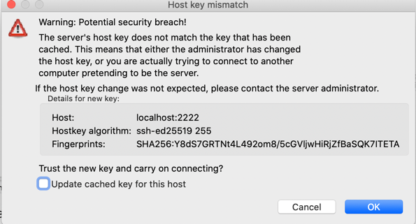

## Local SFTP Server


-  Make sure you are in sftp folder
-  Run below script 

```shell

:; rm -rf ./secrets ./config ./data-dir/upload
:; mkdir -p ./secrets ./config ./data-dir/upload/{abc,xyz}

:; cd secrets

# create the secret with empty password

:; ssh-keygen -t ed25519 -f ssh_host_ed25519_key -N '' -C user@127.0.0.1 < /dev/null
:; ssh-keygen -t rsa -b 4096 -f ssh_host_rsa_key -N '123' -C user@127.0.0.1 < /dev/null
:; chmod -Rf 777 *.*
:; cp ssh_host_rsa_key.pub ../config/authorized_keys
:; chmod -Rf 777 ../config/authorized_keys

:; cd .. 

:; touch ./data-dir/upload/abc/123.txt
:; echo 'Hello' >  ./data-dir/upload/abc/123.txt


# UserName = user
# Password = 123

:; echo "user:123:1001:100" > config/users.conf

:; echo 'Done !!!'

:;

```

### Where to put files ?

```shell
Keep the file in folder ./data-dir/upload that you want to download via SFTP
```

### How to start SFTP ?

```shell

docker-compose down ; docker-compose up


```

### How to connect ?

```shell
Connect on :  Host  : localhost , port :  2222, user-name : user  , password : 123

Use FileZilla to connect or use any other SFTP client tool..

Post connection you should be able to see the a folder /upload  and files inside that folder ...
```

```shell
docker container ls -a # see if container is in failed state
```

---

- FileZilla


- Accept this

